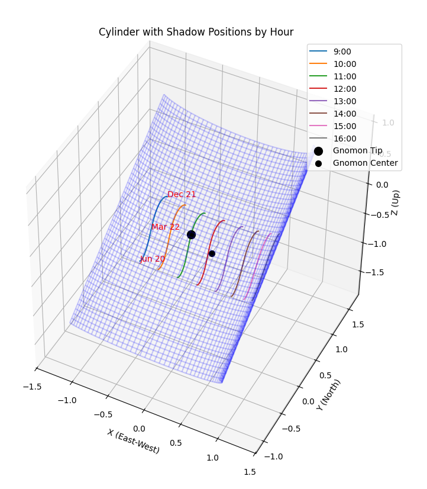
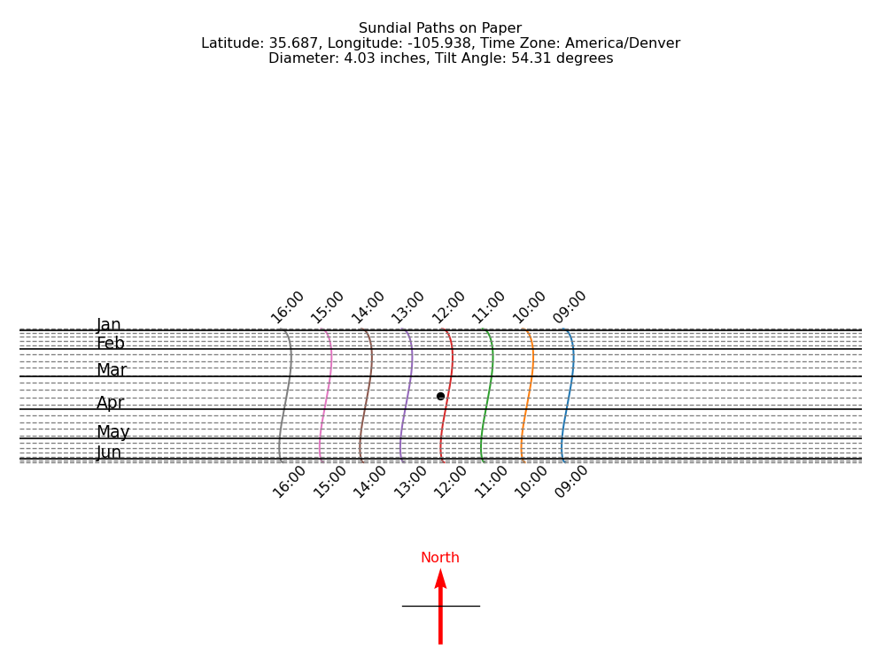

# hpop-sundial
A Python code to generate a high precision [hemicylindrical sundial](https://www.shadowspro.com/en/cylindrical-sundial.html). This produces a 3D representation as well as a PDF file that you can print out (make sure to print true to scale) and tape or glue to the inside of a cylinder. Mount a bead on a clear line (e.g. a fishing line) across the cylinder just above the black gnomon dot, to cast a shadow.

This design is similar to that [sold by Albin Hoffmann](https://www.precisionsundials.eu/), although the concept has been around for literally thousands of years. Today these can be very accurate by using codes like Astropy to compute detailed solar trajectory curves.

*Paper printout (PDF) to be glued or taped to the inside of a half-pipe cylinder:*

